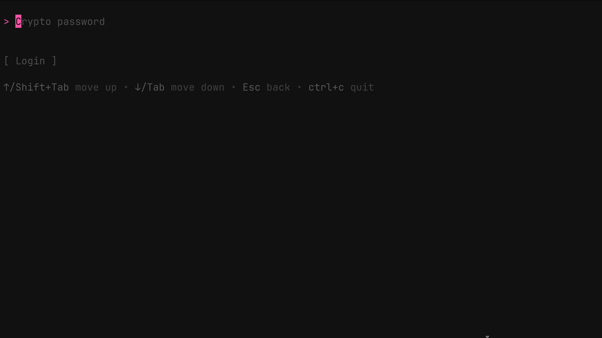

# GophKeeper — пассворд-менеджер на Go

**GophKeeper** — TUI-пасcворд-менеджер на Go
Все данные шифруются и расшифровываются **исключительно на клиенте**; сервер получает и хранит только уже зашифрованные байты.
Шифрование реализовано при помощи **AES-GCM** (Galois/Counter Mode).



---

### Возможности

- **Zero-Knowledge** — сервер ничего не знает о ваших секретах
- **Поддерживаемые типы данных**
  - **Пароли** (login + password + URL)
  - **Заметки**
  - **Банковские карты**
  - **Файлы** любых форматов (binary)
- **TUI-клиент** на Bubble Tea — работает прямо в терминале
- **REST API** с автогенерацией Swagger-спеки
- **Файловое хранилище** MinIO для бинарных данных

---

### Быстрый старт

```bash
# 1. Поднимаем инфраструктуру (Postgres + MinIO)
docker compose up -d

# 2. Запускаем сервер
make run-server

# 3. Запускаем TUI-клиент в отдельном терминале
make run-client
```

> **Примечание:** `docker-compose.yml` содержит только Postgres и MinIO.
> Сам backend и клиент собираются и запускаются локально командами `make`.

### Документация API

Swagger будет доступен после запуска сервера:

```
http://localhost:8080/swagger/index.html
```

Сгенерировать доку вручную:

```
make swag
```

---
